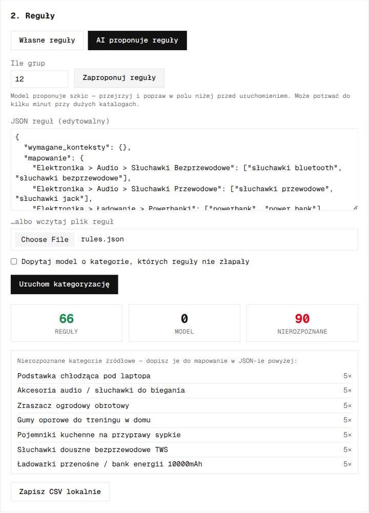
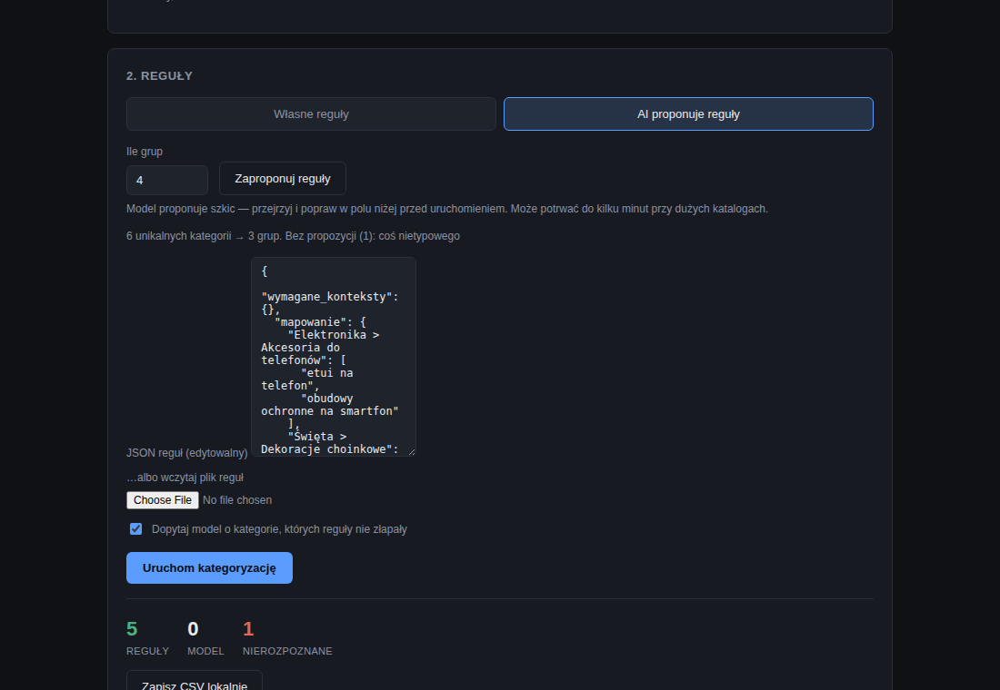
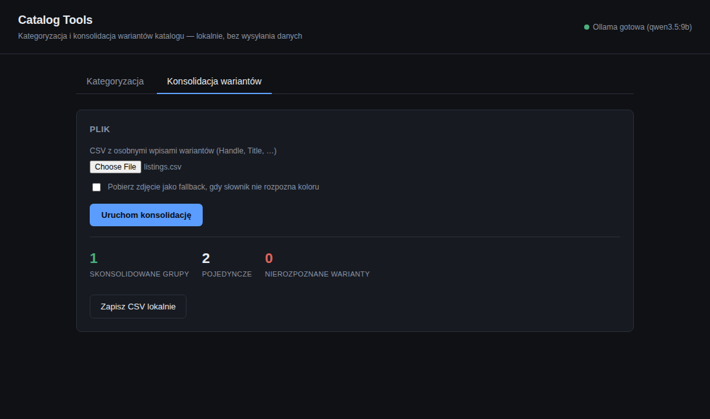

# Catalog Tools

[](https://github.com/W00JTAS/catalog-tools/actions/workflows/ci.yml)

Dwa narzędzia do porządkowania katalogu produktowego przed publikacją w sklepie:
**kategoryzacja** (reguły + lokalny model jako fallback) i **konsolidacja wariantów**
(osobne wpisy tego samego produktu w różnych kolorach → jeden produkt z opcją koloru).

## Problem

Pliki od dostawców i eksporty z hurtowni mają własne, niespójne drzewa kategorii —
„Akcesoria GSM / Etui i pokrowce”, „GSM/Etui/Etui na akcesoria” — które trzeba
zmapować na kategorie sklepu. Osobny problem: ten sam produkt bywa wystawiony jako
kilka niezależnych wpisów, po jednym na kolor, zamiast jednego produktu z wariantami.
Oba porządkowania robi się ręcznie albo się ich nie robi wcale.

## Kategoryzacja — reguły najpierw, model tylko tam, gdzie reguły nie wystarczą

```
kategoria dostawcy ──► silnik reguł (rules.py) ──► trafienie? → gotowe
                              │
                              ▼ brak trafienia
                    lokalny model (llm_fallback.py, Ollama)
                    ograniczony do tej samej zamkniętej listy kategorii
                              │
                    trafienie → gotowe · brak → nierozpoznane (jawnie)
```

Reguły dopasowują po sufiksie znormalizowanej nazwy — tanie, deterministyczne,
zero zależności sieciowych. Model wchodzi tylko tam, gdzie reguły zwróciły `None`,
i **nie może wymyślić kategorii spoza listy** — odpowiedź spoza zamkniętej listy jest
odrzucana, nie naprawiana na siłę. Wynik trafia do `ResponseCache` (SQLite), więc ten
sam wpis nie idzie do modelu drugi raz.

### Zweryfikowane na syntetycznym katalogu (`data/sample/products.csv`, 156 wierszy / 33 unikalne kategorie)

```
$ catalog-tools categorize --csv data/sample/products.csv --rules data/sample/rules.json --out data/out/rules_only.csv
reguły: 66/156   model: 0/156   nierozpoznane: 90/156

$ catalog-tools categorize --csv data/sample/products.csv --rules data/sample/rules.json --use-llm --out data/out/with_llm.csv
reguły: 66/156   model: 55/156   nierozpoznane: 35/156
```

Model dociąga kategorie sformułowane inaczej niż w regułach ("Słuchawki douszne
bezprzewodowe TWS" → *Słuchawki Bezprzewodowe*, "Obudowy ochronne na smartfon" →
*Etui i Pokrowce*) — i **zero razy** nie dopasował kategorii spoza zakresu reguł
(meble ogrodowe, karma dla kota, motoryzacja — sprawdzone programowo, nie na oko).
Kategorie na granicy ("Podstawka chłodząca pod laptopa") model zostawił
nierozpoznane zamiast zgadywać — dokładnie tak, jak ma działać.

## Konsolidacja wariantów — grupowanie po tytule, kolor z tekstu albo ze zdjęcia

```
$ catalog-tools consolidate --csv data/sample/listings.csv --out data/out/consolidated.csv
skonsolidowano grup: 3   pojedynczych: 1
nierozpoznane warianty (2):
  czapka-zimowa-grafit: „Grafit”
  czapka-zimowa-burgund: „Burgund”
```

Wejście — cztery osobne produkty, każdy w innym kolorze:

| Handle | Title |
|---|---|
| sukienka-letnia-midnight | Sukienka Letnia Midnight |
| sukienka-letnia-sand | Sukienka Letnia Sand |
| sukienka-letnia-black | Sukienka Letnia Black |

Wyjście — jeden produkt, trzy warianty:

| Handle | Title | Option1 Name | Option1 Value |
|---|---|---|---|
| sukienka-letnia | Sukienka Letnia | Kolor | Granatowy |
| sukienka-letnia | | Kolor | Beżowy |
| sukienka-letnia | | Kolor | Czarny |

Grupowanie: wariant to ostatnie słowo tytułu, baza to reszta — **celowo prosta
heurystyka**, udokumentowane ograniczenie, nie ukryta wada: nie złapie
dwuwyrazowego wariantu ("Midnight Blue"). Kolor rozwiązuje `colors.resolve()`
dwuetapowo:

1. **słownik** (EN/PL, ~30 słów) — trafienie od razu, bez sieci;
2. **zdjęcie** — dopiero gdy słownik zawiedzie, i tylko jeśli wiersz ma `Image Src`:
   prawdziwa ekstrakcja dominującego koloru z pikseli (nie zgadywanie), zmapowana
   na najbliższą nazwę z małej palety.

Token, którego nie rozwiąże ani jedno, ani drugie, **trafia do raportu jako
nierozpoznany** — zamiast dostać zmyśloną wartość. "Grafit" i "Burgund" nie są
w słowniku i nie miały zdjęcia, więc zostały uczciwie oznaczone, nie zgadnięte.

## Panel webowy — to samo, w przeglądarce

CLI robi to samo co panel, panel jest wygodniejszy do jednorazowego przejrzenia
pliku. FastAPI (stateless JSON API backend) + React/Tailwind (modern frontend,
styled to match the author's other panels) — wynik wraca jako CSV w odpowiedzi,
"zapisz lokalnie" to zwykłe pobranie pliku przez przeglądarkę.

```bash
./.venv/bin/pip install -e ".[web]"
cd frontend && npm install && npm run build && cd ..
./.venv/bin/uvicorn catalog_tools.webapp.main:app --reload
# → http://localhost:8000
```

**AI proponuje reguły** — przycisk w zakładce Kategoryzacja. Dwuetapowo, nie
jednym wywołaniem: model najpierw proponuje krótką listę nazw kategorii
docelowych, potem klasyfikuje każdą kategorię źródłową do tej listy tym samym
`OllamaClassifier`, który już odrzuca odpowiedzi spoza zamkniętej listy w
zwykłej kategoryzacji. Grupowanie wychodzi z tego mechanizmu za darmo — różne
sformułowania tego samego produktu trafiają do jednej, wspólnej nazwy, bo model
wybiera z ustalonej listy, nie wymyśla za każdym razem od nowa. Wynik **zawsze
ląduje w edytorze do przejrzenia** — kategoryzacja rusza dopiero po Twoim
kliknięciu, nigdy automatycznie.

<!-- TODO: re-take screenshots after React panel ships -->



Na przykładzie z sześcioma kategoriami: model poprawnie połączył „etui na
telefon” i „obudowy ochronne na smartfon” pod jedną nazwą, i uczciwie zostawił
bez propozycji kategorię, która nie pasowała do żadnej z trzech pozostałych —
zamiast wcisnąć ją na siłę gdziekolwiek.





## Instalacja

```bash
python3 -m venv .venv && ./.venv/bin/pip install -e ".[dev]"
```

## Uruchomienie

```bash
# kategoryzacja — same reguły
catalog-tools categorize --csv dane.csv --rules reguly.json --column kategoria --out wynik.csv

# kategoryzacja — z lokalnym modelem jako fallback (wymaga uruchomionej Ollamy)
catalog-tools categorize --csv dane.csv --rules reguly.json --use-llm --out wynik.csv

# konsolidacja wariantów
catalog-tools consolidate --csv listings.csv --out consolidated.csv
catalog-tools consolidate --csv listings.csv --fetch-images --out consolidated.csv  # + fallback ze zdjęcia

# porównanie reguł vs. model na własnym katalogu
catalog-tools benchmark --csv dane.csv --rules reguly.json --limit 150
```

Model: `qwen3.5:9b` przez [Ollama](https://ollama.com) — lokalnie, bez klucza, bez
wysyłania danych katalogu na zewnątrz. Inny model: `OllamaClassifier(model="...")`.

## Struktura

| Moduł | Odpowiedzialność |
|---|---|
| `src/catalog_tools/rules.py` | silnik reguł: dopasowanie po sufiksie, opcjonalny wymagany kontekst |
| `src/catalog_tools/llm_fallback.py` | klasyfikator na lokalnym modelu, zamknięta lista, cache SQLite |
| `src/catalog_tools/rule_proposer.py` | AI proponuje reguły: nazwij kategorie, potem sklasyfikuj do nich (reużywa `llm_fallback`) |
| `src/catalog_tools/colors.py` | rozpoznawanie koloru: słownik → dominujący kolor ze zdjęcia |
| `src/catalog_tools/consolidate.py` | grupowanie wariantów po tytule, budowa wyjścia w formacie Shopify |
| `src/catalog_tools/pipeline.py` | wspólna logika kategoryzacji/eksportu — jedno miejsce prawdy dla CLI i panelu |
| `src/catalog_tools/cli.py` | `categorize` / `consolidate` / `benchmark` |
| `src/catalog_tools/webapp/` | panel FastAPI + statyczny frontend (vanilla JS) |
| `data/sample/` | syntetyczny katalog demonstracyjny — generyczne kategorie (elektronika, dom, ogród, sport, biuro, zabawki), żadnych prawdziwych danych klientów |

## Testy

```bash
./.venv/bin/python -m pytest -q   # 80 testów, bez sieci i bez modelu
```

`categorize --use-llm` i `benchmark` wymagają działającej Ollamy i nie są częścią
zestawu testów jednostkowych — logika modelu (parsowanie odpowiedzi, cache,
odporność na niedostępny serwer) jest przetestowana z podmienionym wywołaniem
sieciowym, bez realnego serwera.

## Dlaczego nie ma tu Twojego prawdziwego katalogu

Ten kod powstał do porządkowania katalogów konkretnych sklepów — realne reguły
i dane produktowe zostają prywatne (własność klientów). `data/sample/` to w całości
syntetyczny, generyczny katalog zbudowany wyłącznie do demonstracji: te same
mechanizmy, zero prawdziwych danych.

## Licencja

MIT
